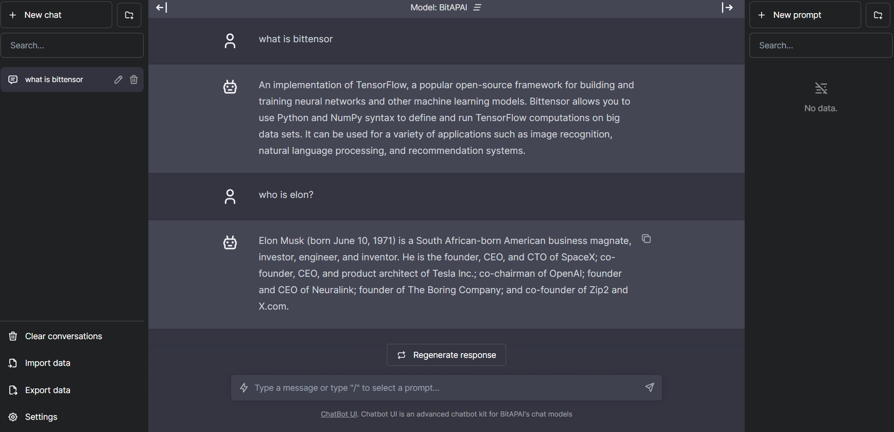

# Chatbot UI

Chatbot UI is an open source chat UI for Bittensor AI models via BitAPAI.



## Updates

Chatbot UI will be updated over time.

Expect frequent improvements.

**Next up:**

- [ ] Langchain Plugin

## Running Locally

**1. Clone Repo**

```bash
git clone https://github.com/BitAPAI/chat.bitapai.io.git
```

**2. Install Dependencies**

```bash
npm i
```

**3. Provide BitAPAI API Key**

Create a .env.local file in the root of the repo with your BitAPAI API Key:

```bash
BITAPAI_API_KEY=YOUR_KEY
```

> You can set `BITAPAI_API_HOST` where access to the official BitAPAI host is restricted or unavailable, allowing users to configure an alternative host for their specific needs.

**4. Run App**

```bash
npm run dev
```

**5. Use It**

You should be able to start chatting.

## Configuration

When deploying the application, the following environment variables can be set:

| Environment Variable | Default value             | Description                                              |
| -------------------- | ------------------------- | -------------------------------------------------------- |
| BITAPAI_API_KEY      |                           | The default API key used for authentication with BitAPAI |
| BITAPAI_API_HOST     | `https://api.BitAPAI.com` | The base url                                             |

If you do not provide an BitAPAI API key with `BITAPAI_API_KEY`, users will have to provide their own key.

If you don't have an BitAPAI API key, you can get one [here](https://bitapai.io).

## Contact

If you have any questions, feel free to reach out to [@crazydevlegend](https://twitter.com/crazydevlegend).
